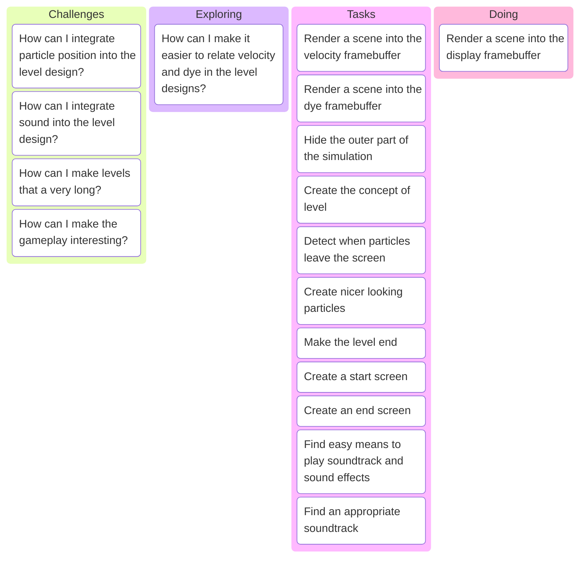

# Developer set-up

## Windows

Install [fnm](https://github.com/Schniz/fnm)

In a powershell terminal npm using:

```powershell
fnm env --use-on-cd | Out-String | Invoke-Expression
```

# Board



## How can I make it easier to relate velocity and dye in the level designs?

I need to fill two framebuffers with level content, one with dye pixels, and one with velocity pixels. Currently these are loaded as texture images, but this has some disadvantages:

1. Large levels means the textures will become very large
2. It is very hard to relate velocity and dye
3. It is hard to predict how long a level will take
4. The effect of the dye and velocity is hard to predict

The common denominator for all of these is that I want to render into the dye and velocity framebuffers. How this should be done and what information I need for this greatly determines the fitness of any solution.

> - Task: Render a scene into the display framebuffer (prototyping)
> - Task: Render a scene into the velocity framebuffer
> - Task: Render a scene into the dye framebuffer

Options:

- **REJECTED. Using two.js to render SVG to WebGL.**

    Renders SVG to a texture, not to WebGL directly

- Vector graphics drawing tool.
- Use a 3D modeling tool.
- Create a dedicated level editor.
- Design the levels in text.

### Using two.js

See https://two.js.org/. two.js can render SVG to WebGL, but it does so byu rendering it to a texture and putting that on a quad.

### Using a vector graphics tool

I could use a vector graphics drawing tool with layers. One layer for the dye, one for the velocity. The vector graphs can be rendered into the framebuffer.

This only works well if I can convert the vector image to WebGL.

Example tools:

- Inkscape

#### Inkscape

Inkscape uses SVG as file format. Can it do layers, and how easy is it to translate simple objects, colors and gradients to WebGL?

Render SVG to a texture first, so not using WebGL, or to triangles?

**Answer: Better render to triangles.**

> I have a preference for creating triangles as I think that would give more flexibility in creating large levels. With rendering to a texture you still end up with a very large texture. According to Copilot "Most modern GPUs support a maximum texture size of at least 8192x8192 pixels" or 1GB. At a width of 1024 pixels that would mean 65515 lines, that's not even that much and would give a tremendous load either to generate it or to have it on disk.

Rendering SVG to OpenGL triangles is not very common and can be pretty complex apparently. I did find the link below, but that only works on a single SVG path, and only for single color paths.

Links:

- https://css-tricks.com/rendering-svg-paths-in-webgl/
- https://www.reddit.com/r/opengl/comments/1c31bmv/how_do_i_convert_a_svg_image_into_an_array_of/?rdt=33807

### Using a 3D modeling tool

Links:

- https://assimp-docs.readthedocs.io/en/latest/about/introduction.html
